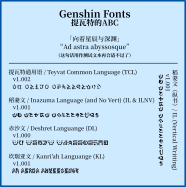

# Genshin Fonts

**提瓦特的 ABC!**

中文 | [English](README.md)

## 食用方法

### 获取字体

构建好的字体可以到 `Build` 文件夹获取。

*注：Windows 平台更推荐 TTF 格式。*

### 关于稻妻文（及其无纵版本）

稻妻文有两个版本，一个有 Opentype 特性 `vert`，另一个没有。有了它以及支持的应用（例如 [LibreOffice](https://www.libreoffice.org/)），稻妻文就能像在游戏中一样纵书。但使用 Adobe 应用时，请选择没有 `vert` 的版本。

## 构建字体

0. 安装 [AFDKO](https://github.com/adobe-type-tools/afdko)。

1. 克隆此仓库：

        $ git clone https://github.com/Wenti-D/GenshinFonts
        $ cd GenshinFonts

2. 构件 OTF：

        $ makeotf -f <UFO folder>

    例：

        $ makeotf -f TeyvatCommonLanguage.ufo

3. 将 OTF 转为 TTF（可选）:

        $ otf2ttf input <OTF file>

    例：

        $ otf2ttf input TeyvatCommonLanguage-Regular.otf

## 贡献与反馈

如有任何问题，特别是设计上的问题（包括字形、大小、字距等等），还请开启一个议题（issue）。